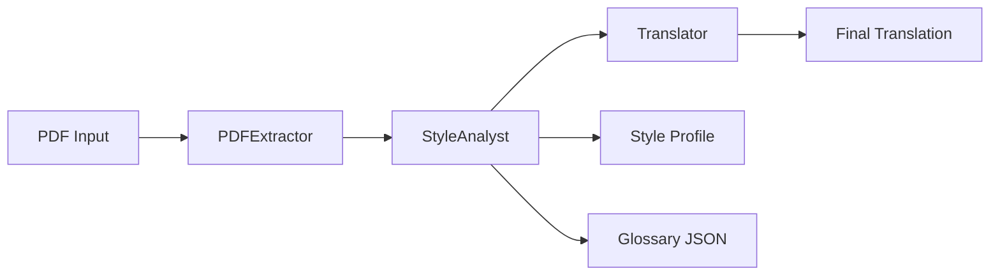

# Agentic Literary Translation Pipeline via Gemini API

<p align="center">
  <b>System-level LLM pipeline for high-fidelity literary translation</b><br/>
  <i>Showcasing agentic workflows, NLP reasoning, and production-aware engineering</i>
</p>

<p align="center">
  
  
  
  
</p>

---

## Project Value 

This project demonstrates the ability to:

* **Design agentic AI systems** (beyond prompt engineering)
* **Build modular, scalable pipelines**
* **Control LLM behavior programmatically** (style, terminology, context)
* **Handle real-world constraints** (rate limits, failures, long documents)
* **Bridge NLP theory and engineering practice**

> A system-first approach to LLM translation — not a single prompt.

---

## Key Concepts Demonstrated

| Area               | Implementation                                    |
| ------------------ | ------------------------------------------------- |
| LLM Orchestration  | Multi-stage pipeline (analysis → translation)     |
| NLP                | Style modeling + glossary extraction              |
| System Design      | Modular architecture (independent components)     |
| Reliability        | Retry logic with exponential backoff (`tenacity`) |
| Context Management | Rolling context window for coherence              |

---

## How It Works



### Pipeline Logic

1. **Extract** → Clean and normalize raw PDF text
2. **Analyze** → Infer writing style + extract terminology
3. **Translate** → Generate consistent output using contextual memory

---

## Architecture

### `PDFExtractor`

* PDF ingestion
* header/footer removal (bounding boxes)
* hyphenation fixing
* Markdown normalization

### `StyleAnalyst`

* detects stylistic patterns (idiolect)
* extracts entities and domain-specific terms
* outputs structured glossary (JSON)

### `Translator`

* chapter-by-chapter translation
* rolling context injection (previous source + translation)
* style + glossary enforcement

---

## Engineering Highlights

* **Resilient API handling** → retries + exponential backoff
* **Incremental state saving** → no full reruns on failure
* **Context-aware prompting** → reduces drift and hallucinations
* **Separation of concerns** → each module independently testable

---

## Project Structure

```bash
.
├── main.py
├── src/
│   ├── pdf_extractor.py
│   ├── style_analyst.py
│   └── translator.py
├── prompts/
│   ├── glossary_prompt.txt
│   ├── style_prompt.txt
│   └── translation_prompt.txt
├── .env.example
├── requirements.txt
└── README.md
```

---

## Installation

```bash
git clone https://github.com/yourusername/agentic-translation-pipeline.git
cd agentic-translation-pipeline
pip install -r requirements.txt
```

```env
GEMINI_API_KEY="YOUR_API_KEY"
```

---

## Usage

### Full translation

```bash
python main.py --pdf "book.pdf"
```

### Partial translation (debug/testing)

```bash
python main.py --pdf "book.pdf" --chapters 3
```

---

## Output

* Clean Markdown source
* Style + glossary analysis
* Final translated text

---

## Evolution

This project is a **complete redesign** of a previous implementation: a page-by-page PDF translation tool using LLMs.

### Previous approach

* single-script architecture
* prompt-driven translation
* page-level context only
* JSONL output per page

### Current approach

* modular, multi-component system
* agentic workflow (analysis → translation)
* style-aware and glossary-driven output
* rolling context for long-form coherence

> This evolution reflects a shift from *tool building* to *system design*.

---

## Roadmap

* [ ] Multi-language support
* [ ] Web interface (Streamlit / Next.js)
* [ ] Parallelized translation
* [ ] Evaluation metrics (BLEU / LLM scoring)
* [ ] Advanced glossary control

---

## Contributing

Contributions are welcome.

1. Fork the repository
2. Create a feature branch
3. Commit your changes
4. Open a Pull Request

---

## Contact

If you're interested in this project:

* Open an issue
* Connect via GitHub

---

<p align="center">
  Built to showcase real-world AI system design skills
</p>
